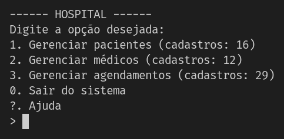

# C Hospital CRUD

A compact, educational CRUD system for a hospital management scenario developed for the "Programming Language II" discipline at UESC's Computer Science Course.

Versão em Português 🇧🇷: [README-pt_BR.md](README-pt_BR.md).

**Authors:**
- Arthur de Carvalho ([CarvDev](https://github.com/CarvDev))
- Rafael Mota ([rafaelmotafreitas](https://github.com/rafaelmotafreitas))

**Objective:**
Provide a clear, well-structured implementation in C that demonstrates core systems programming skills: modular design, dynamic data structures, memory management, and file-based persistence. The project is intended both as a learning exercise and as a showcase of the authors' C-language proficiency.

**Key Features:**
- Patient management: create, view, edit, remove records.
- Doctor management: create, view, edit, remove records.
- Appointment scheduling: create, view, edit, remove appointments linking patients and doctors.
- Console-based user interface with modularized code and clear separation between data logic and UI.

**Tech Stack & Skills Demonstrated:**
- Language: C (ISO C, idiomatic use of pointers, structs and arrays).
- Build: `Makefile` with simple targets to build and run the program using `gcc`.
- Memory management: low level memory manipulation with `memmove()` and dynamic memory allocation (`malloc`/`free`), with doubling strategy and careful lifetime handling.
- Data structures: custom linked lists and dynamic arrays to store records in memory.
- Recursion: recursive implementation of the Binary Search algorithm.
- CLI arguments: quick data export/reset and help menu on terminal.    
- Bitwise operations: converting lowercase characters into uppercase without the `toupper()` function.
- Pointers: efficient data manipulation, pointer arithmetic and generic functions with `void*` data type.  
- System calls: directory creation function defined with conditional compilation for portability on both Windows and POSIX systems.
- Timestamp management: for efficiently handling time oriented operations, such as appointments.
- Error handling: input buffer cleaning, string normalization and memory safety.
- File I/O: persistent storage using standard C file APIs (`fopen`, `fread`, `fwrite`, `fclose`).
- Modularization: split across headers and sources (`paciente.c/.h`, `medico.c/.h`, `agendamento.c/.h`, `auxiliar.c/.h`) to demonstrate API design in C.

**Repository Structure (high level):**
- `main.c` — program entry and menu loop
- `paciente.c` / `paciente.h` — patient CRUD logic
- `medico.c` / `medico.h` — doctor CRUD logic
- `agendamento.c` / `agendamento.h` — appointment logic linking patients and doctors
- `auxiliar.c` / `auxiliar.h` — helper utilities and I/O helpers
- `Makefile` — build and run targets
- `dados/` — directory intended for persisted data files

**Build & Run:**
1. Build: run `make` (requires `gcc`)
2. Run: `./hospital` 
3. Show help menu: `./hospital --help`
4. Reset data: `./hospital --reset`
5. Export data: `./hospital --export`

**Compatibility:**
The project is designed to be compatible with Windows, GNU/Linux and macOS/BSD operating systems.

**License & Contribution:**
This project is licensed under MIT, as stated in the `LICENSE` file. Contributions and improvements are currently not expected, as this project is considered finished.